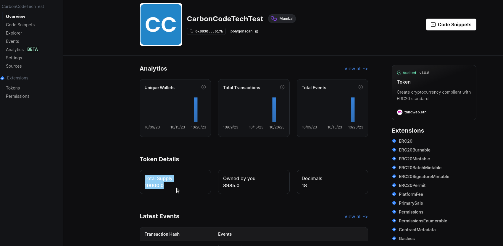

# CarbonCodeTechTest

---

## Part 1: Frontend Development

**Task**

Create a simple web application that allows users to connect their ETH or other EVM based
wallet, display the wallet balance, and send a transaction.

> @Aaron - "Application is deployed on vercel at: https://carbon-code-tech-test.vercel.app/"

> :warning: Use Mumbai test network :warning:

**Requirements**

### Wallet Connection:

---

- Implement a button to connect a web3 wallet (e.g., MetaMask) to the application.
- Display the connected wallet address on the webpage.

---

### Balance Display:

---

After wallet connection, fetch and display the current balance of the connected wallet.

---

> @Aaron - "Connect button with wallet and balance"


---

### Transaction Creation & Confirmation:

---

- Implement a button that, when clicked, creates and sends a simple transaction from
  the connected wallet to a specified address (e.g., transferring a small amount of
  ETH).

---

> @Aaron - "Awaiting metamask confirmation and block confirmation"


> @Aaron - "Wallet confirmation - Metamask, Coinbase or WalletConnect can be used"


---

- Display a confirmation message on the webpage once the transaction has been
  successfully mined.

---

> @Aaron - "Success with link"


---

- Then, display the transaction hash and provide a link to view the transaction on a
  block explorer like Polygonscan.

---

> @Aaron - "Link directs to appropriate explorer and only appears when available (hash is hidden from user to be cleaner)"


---

## Part 2: Smart Contract Development

**Task**

Write a Solidity smart contract that represents a simple asset with a fixed supply on the
~~Polygon~~ **Mumbai** (Polygon test) network.

> @Aaron - "Modern contracts widely use industry standards such as open zeppelin, ERC proposals and services such as thirdweb. Token contract: [TokenERC20.sol](lib/contracts/contracts/prebuilts/token/TokenERC20.sol) is audited, robust and feature rich."

**Requirements**

---

### Smart Contract Creation:

---

- The smart contract should have a fixed supply of tokens representing carbon credits.

---

> @Aaron - "Supply set to 10000 tokens initially which can be handled from services dashboard, called manually or using explorer"



>"@Aaron - Further supply can be minted on demand"


---

- Implement functions to transfer the asset between addresses and to query the
  balance of an address.

---

> @Aaron - "Check balance and transfer a token"


> @Aaron - "Balance reduced"


---

### Basic Security:

---

- Ensure that only the owner can mint new assets.

---

> @Aaron - "MINTER_ROLE can be set by DEFAULT_ADMIN_ROLE"


> @Aaron - "Minter protects minting by require of role or with verify and mint with sig"


---

- Handle common security considerations like re-entrance and integer
  overflow/underflow.

---

> @Aaron - "Solidity 0.8 and above largely fixed under/overflows removing need for SafeMath"

> @Aaron - "ReentrancyGuardUpgradeable is extended to give nonReentrant modifier - Removing value from sender before providing value also protects against re-entrance as in collectPrice before mint."


---

### Testing:

> @Aaron - "Setup Instructions:"

---

Pre-Req:

- Node Version Manager - https://github.com/coreybutler/nvm-windows
- yarn - https://classic.yarnpkg.com/lang/en/docs/install/#debian-stable

---

- Install Node 20. Assuming nvm is installed:

```bash
nvm install 20
```

- Install Foundry/Forge

[Installation Documentation](https://book.getfoundry.sh/getting-started/installation)

- Switch to contracts directory

```bash
cd lib/contracts
```

- Install contract dependencies

```bash
yarn
```

- Install test dependencies

```bash
forge install
```

- Compile Contracts

```bash
forge build
```

- Test Token Contract

```bash
forge test --match-path src/test/token/TokenERC20.t.sol
```

- Output:

```bash
aaron@pop-os:~/WebstormProjects/CarbonCodeTechTest/lib/contracts$ forge test --match-path src/test/token/TokenERC20.t.sol
[⠢] Compiling...
No files changed, compilation skipped

Running 22 tests for src/test/token/TokenERC20.t.sol:TokenERC20Test
[PASS] test_event_mintTo() (gas: 122728)
[PASS] test_event_mintWithSignature() (gas: 188464)
[PASS] test_event_platformFeeInfo() (gas: 31788)
[PASS] test_event_setPrimarySaleRecipient() (gas: 26551)
[PASS] test_revert_mintTo_NotAuthorized() (gas: 18999)
[PASS] test_revert_mintWithSignature_InvalidSignature() (gas: 75206)
[PASS] test_revert_mintWithSignature_MsgValueNotZero() (gas: 149757)
[PASS] test_revert_mintWithSignature_MustSendTotalPrice() (gas: 140692)
[PASS] test_revert_mintWithSignature_RecipientUndefined() (gas: 75909)
[PASS] test_revert_mintWithSignature_RequestExpired() (gas: 69033)
[PASS] test_revert_mintWithSignature_ZeroQuantity() (gas: 73064)
[PASS] test_revert_setContractURI_NotAuthorized() (gas: 76762)
[PASS] test_revert_setPlatformFeeInfo_ExceedsMaxBps() (gas: 18942)
[PASS] test_revert_setPlatformFeeInfo_NotAuthorized() (gas: 76719)
[PASS] test_revert_setPrimarySaleRecipient_NotAuthorized() (gas: 76872)
[PASS] test_state_mintTo() (gas: 126549)
[PASS] test_state_mintWithSignature_NonZeroPrice_ERC20() (gas: 314729)
[PASS] test_state_mintWithSignature_NonZeroPrice_NativeToken() (gas: 303402)
[PASS] test_state_mintWithSignature_ZeroPrice() (gas: 187008)
[PASS] test_state_setContractURI() (gas: 30017)
[PASS] test_state_setPlatformFeeInfo() (gas: 31700)
[PASS] test_state_setPrimarySaleRecipient() (gas: 25797)
Test result: ok. 22 passed; 0 failed; 0 skipped; finished in 205.83ms
 
Ran 1 test suites: 22 tests passed, 0 failed, 0 skipped (22 total tests)
```

---

- unauthorised users cannot mint new assets.

---

```solidity
function test_revert_mintTo_NotAuthorized() public {
  uint256 _amount = 100;

  vm.expectRevert("not minter.");
  vm.prank(address(0x1));
  tokenContract.mintTo(recipient, _amount);
}
```

---

- transfers update balances correctly

---

```solidity
  function test_state_mintTo() public {
      uint256 _amount = 100;

      uint256 currentTotalSupply = tokenContract.totalSupply();
      uint256 currentBalanceOfRecipient = tokenContract.balanceOf(recipient);

      vm.prank(deployerSigner);
      tokenContract.mintTo(recipient, _amount);

      assertEq(tokenContract.totalSupply(), currentTotalSupply + _amount);
      assertEq(tokenContract.balanceOf(recipient), currentBalanceOfRecipient + _amount);
  }
```